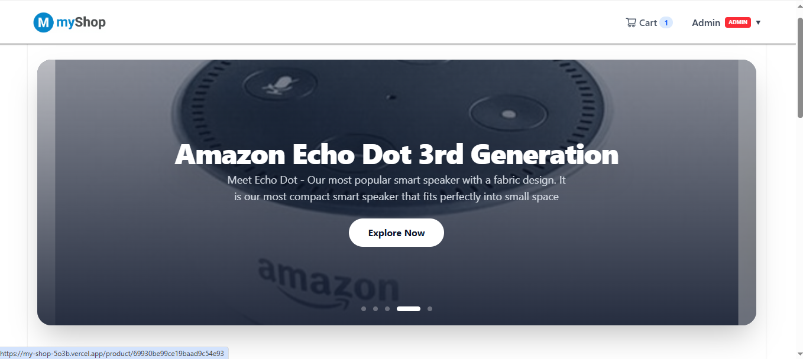
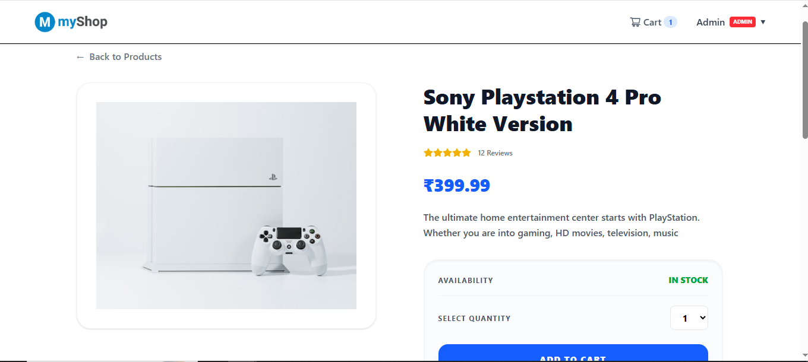
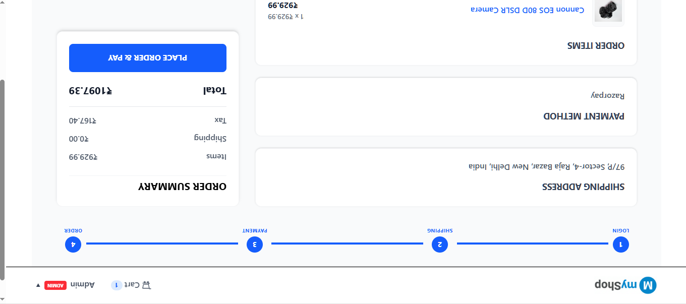
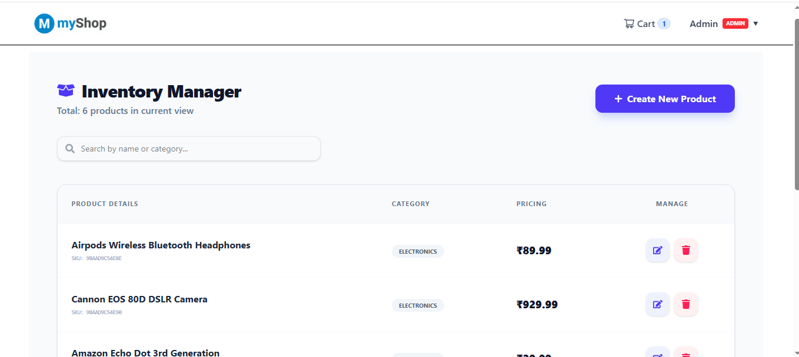

# 🛒 MyShop – MERN E-Commerce Application

A full-stack e-commerce web app built with the **MERN stack**. Users can browse products, add them to a cart and pay online with **Razorpay** or choose **Cash on Delivery**. Admins manage products, orders and users from a dashboard.

Built and deployed by me as a **solo project** to practise real-world full-stack development: authentication, payments, image uploads and deployment.

🔗 **Live demo:** https://my-shop-5o3b.vercel.app/
🔗 **Backend API:** https://my-shop-ykbx.onrender.com/
🔗 **GitHub:** https://github.com/Ishan-Riyal/My-Shop

> ⏳ The backend is hosted on Render's free plan, so the **first request can take 30–60 seconds** while the server wakes up. Please wait a moment and refresh.

---

## 🔑 Demo Accounts

| Role  | Email           | Password |
| ----- | --------------- | -------- |
| Admin | admin@email.com | admin989 |
| User  | rahul@email.com | rahul989 |

These are demo accounts only. Please don't change their passwords or delete data.

---

## 📸 Screenshots

| Home                               | Product Details                          |
| ---------------------------------- | ---------------------------------------- |
|  |  |

| Checkout / Payment                         | Admin Dashboard                      |
| ------------------------------------------ | ------------------------------------ |
|  |  |

---

## ✨ Key Features

1. **Secure online payments with Razorpay**
   Orders are created on the server and paid through the Razorpay checkout. The backend verifies the payment using an **HMAC SHA-256 signature** before marking the order as paid. Cash on Delivery is also supported.

2. **Authentication and role-based access**
   JWT stored in an **HTTP-only cookie** (not in localStorage), passwords hashed with **bcrypt**, and separate protected routes for logged-in users and admins. Admins can also block users.

3. **Admin dashboard**
   Admins can create, edit and delete products, upload product images to **Cloudinary**, view and mark orders as delivered, and manage users.

4. **Product browsing**
   Keyword search, pagination, a top-rated products carousel, and product reviews with ratings (one review per user per product).

5. **Cart and checkout flow**
   Cart saved in localStorage, followed by a shipping → payment → place order flow. Prices, shipping and tax are **recalculated on the server** from database prices, so the client cannot tamper with them.

---

## 🧰 Tech Stack

| Layer      | Technologies                                                                              |
| ---------- | ----------------------------------------------------------------------------------------- |
| Frontend   | React 19, Vite, Tailwind CSS 4, Redux Toolkit + RTK Query, React Router 7, React Toastify |
| Backend    | Node.js, Express 5, Mongoose 9                                                            |
| Database   | MongoDB Atlas                                                                             |
| Auth       | JWT (HTTP-only cookie), bcryptjs                                                          |
| Payments   | Razorpay                                                                                  |
| Images     | Cloudinary, Multer                                                                        |
| Deployment | Vercel (frontend), Render (backend)                                                       |

---

## 📁 Project Structure

```
My-Shop/
├── Backend/
│   ├── config/         # MongoDB and Cloudinary setup
│   ├── controllers/    # Order, product and user logic
│   ├── data/           # Sample users and products for seeding
│   ├── middleware/     # Auth, error handling, ObjectId check
│   ├── models/         # Mongoose schemas
│   ├── routes/         # API routes
│   ├── utils/          # Token generation
│   ├── seeder.js       # Import / destroy sample data
│   └── server.js       # App entry point
├── Frontend/
│   ├── public/images/  # Sample product images
│   ├── src/
│   │   ├── components/ # Reusable UI (and Admin/ components)
│   │   ├── hooks/      # usePlaceOrder, useOrderDetails, useHeader
│   │   ├── pages/      # Page components (and Admin/ pages)
│   │   ├── slices/     # Redux slices and RTK Query endpoints
│   │   ├── utils/      # Cart price helpers
│   │   └── main.jsx    # Routes and app setup
│   └── vercel.json     # Rewrites for API and SPA routing
└── package.json        # Root scripts (runs backend + frontend together)
```

---

## 🔌 API Overview

| Method          | Endpoint                             | Access | Description                      |
| --------------- | ------------------------------------ | ------ | -------------------------------- |
| POST            | `/api/users/register`                | Public | Register a user                  |
| POST            | `/api/users/login`                   | Public | Login (sets cookie)              |
| POST            | `/api/users/logout`                  | Public | Logout (clears cookie)           |
| GET/PUT         | `/api/users/profile`                 | User   | View / update own profile        |
| GET             | `/api/users`                         | Admin  | List users (search, paginate)    |
| PUT/DELETE      | `/api/users/:id`                     | Admin  | Update role/block, delete user   |
| GET             | `/api/products`                      | Public | List products (search, paginate) |
| GET             | `/api/products/top`                  | Public | Top-rated products               |
| GET             | `/api/products/:id`                  | Public | Product details                  |
| POST/PUT/DELETE | `/api/products`, `/api/products/:id` | Admin  | Manage products                  |
| POST            | `/api/products/:id/reviews`          | User   | Add a review                     |
| POST            | `/api/orders/create`                 | User   | Create order (+ Razorpay order)  |
| PUT             | `/api/orders/:id/pay`                | User   | Verify payment and mark paid     |
| GET             | `/api/orders/myorders`               | User   | Logged-in user's orders          |
| GET             | `/api/orders/:id`                    | User   | Order details                    |
| GET             | `/api/orders`                        | Admin  | All orders                       |
| PUT             | `/api/orders/:id/deliver`            | Admin  | Mark as delivered                |
| POST            | `/api/upload`                        | -      | Upload image to Cloudinary       |

---

## 🚀 Run Locally

### Prerequisites

- Node.js (developed with v24.7.0)
- A free [MongoDB Atlas](https://www.mongodb.com/atlas) cluster
- A free [Cloudinary](https://cloudinary.com/) account
- A [Razorpay](https://razorpay.com/) account (test keys are enough)

### 1. Clone and install

```bash
git clone https://github.com/Ishan-Riyal/My-Shop.git
cd My-Shop

# backend dependencies (root)
npm install

# frontend dependencies
cd Frontend
npm install
cd ..
```

### 2. Create the `.env` file

Create a `.env` file in the **project root** (next to the root `package.json`):

```env
NODE_ENV=development
PORT=5000
CLIENT_URL=http://localhost:5173
MONGO_URI=your_mongodb_connection_string
JWT_SECRET=your_long_random_secret

RAZORPAY_KEY_ID=your_razorpay_test_key_id
RAZORPAY_KEY_SECRET=your_razorpay_test_key_secret

CLOUDINARY_CLOUD_NAME=your_cloud_name
CLOUDINARY_API_KEY=your_api_key
CLOUDINARY_API_SECRET=your_api_secret
```

> Never commit your real `.env` file. It is already listed in `.gitignore`.

The frontend needs **no** `.env` file. In development, Vite proxies `/api` to `http://localhost:5000`. In production, Vercel rewrites `/api` to the Render backend, which keeps requests same-origin so the secure cookie works.

### 3. (Optional) Seed sample data

```bash
npm run data:import    # adds sample users and 6 products
npm run data:destroy   # removes all users, products and orders
```

⚠️ `data:import` **deletes existing users, products and orders first**. Only run it on a database you are happy to reset. Sample accounts are listed in `Backend/data/users.js`.

### 4. Start the app

```bash
npm run dev
```

- Frontend: http://localhost:5173
- Backend: http://localhost:5000

Other scripts: `npm run server` (backend only), `npm run client` (frontend only), `npm start` (production backend).

---

## 💳 Testing Payments

Payments are meant to be used with **Razorpay test keys**, so no real money is charged. Use Razorpay's published test card or UPI details on the checkout popup, or choose **Cash on Delivery** to skip online payment.

---

## ⚠️ Known Limitations

I'm a fresher and this project is a learning build, so I've listed what it doesn't do yet:

- **Cold start:** Render's free plan sleeps when idle, so the first load can take 30–60 seconds.
- **No automated tests:** the app was tested manually. Unit and integration tests are not added yet.
- **Stock is not reduced after an order**, so `countInStock` is only changed by admins.
- **Authorization gaps to fix:** the image upload route and the order details route need stricter checks (login required for uploads, and an owner-or-admin check for orders).
- **Basic input validation:** the backend does minimal validation. A schema library would make it stricter.
- **No password reset or email notifications.**
- **Payments in test mode only.** There is no refund or payment webhook handling.
- **Single currency (INR)** and no product variants (size, colour).

---

## 🔮 Future Improvements

Planned next steps, in the order I would tackle them:

1. Add authentication to the upload route and an owner-or-admin check on order details.
2. Reduce product stock when an order is placed and block out-of-stock purchases.
3. Add request validation (for example with Zod or express-validator) and rate limiting on login.
4. Write tests: Jest + Supertest for the API and React Testing Library for key components.
5. Add Razorpay webhooks for reliable payment confirmation.
6. Add "forgot password" with email, and order confirmation emails.
7. Add product categories filter, price sorting and a wishlist.

---

## 👨‍💻 Author

**Ishan Riyal** – MERN Stack Developer (MCA graduate)

- GitHub: [Ishan-Riyal](https://github.com/Ishan-Riyal)
- LinkedIn: [ishan-riyal](https://linkedin.com/in/ishan-riyal)

---

⭐ If you found this project useful, consider giving it a star.
